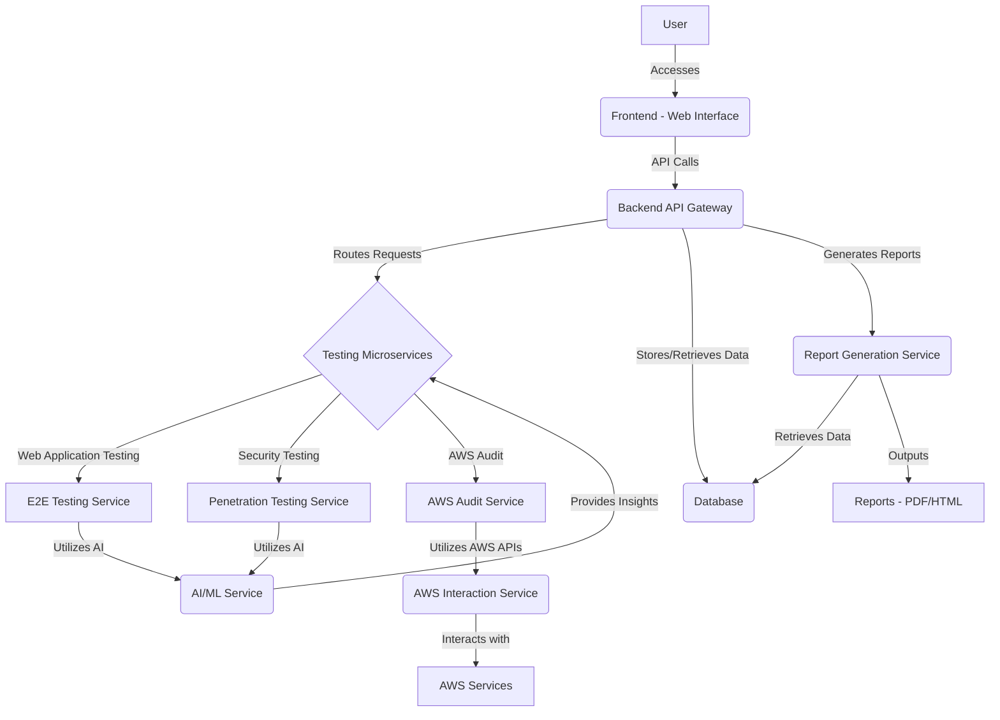

# AI-Powered Web Testing Application: Architecture Design

## 1. Introduction

This document outlines the proposed architecture and key features for a comprehensive website-based AI testing application. The application aims to provide automated, in-depth testing capabilities for websites and software, including security aspects like penetration testing, AWS environment auditing, and automated report generation. A core requirement is the ability to initiate tests simply by providing a URL, leveraging AI for intelligent test execution and analysis.

## 2. Overall Architecture

The application will follow a microservices-oriented architecture, separating concerns into distinct, independently deployable services. This approach enhances scalability, maintainability, and flexibility. The primary components will include a Frontend, a Backend API Gateway, various Testing Microservices, an AI/ML Service, a Report Generation Service, a Database, and an AWS Interaction Service.

## 3. Key Components and Their Responsibilities

### 3.1. Frontend (Web Interface)

**Technology Stack:** React.js (or similar modern JavaScript framework), HTML5, CSS3.

**Responsibilities:**
*   **User Interface:** Provide an intuitive and responsive web interface for users to interact with the application.
*   **Test Configuration:** Allow users to input target URLs, configure test parameters (e.g., test types, depth, frequency), and select reporting options.
*   **Dashboard:** Display real-time test progress, summarized results, and key metrics.
*   **Report Viewing:** Enable users to view, download, and manage generated reports.
*   **Authentication/Authorization:** Handle user login, registration, and role-based access control.

### 3.2. Backend API Gateway

**Technology Stack:** Python (Flask/FastAPI), RESTful APIs.

**Responsibilities:**
*   **Request Routing:** Act as a single entry point for all frontend requests, routing them to the appropriate backend microservices.
*   **Authentication/Authorization:** Enforce security policies and validate user credentials.
*   **Load Balancing:** Distribute incoming requests across multiple instances of microservices.
*   **Rate Limiting:** Prevent abuse and ensure fair usage of the API.
*   **Data Orchestration:** Aggregate data from various microservices before sending it to the frontend.

### 3.3. Testing Microservices

This layer will consist of specialized services responsible for different types of testing.

#### 3.3.1. E2E Testing Service

**Technology Stack:** Python (Selenium/Playwright), AI/ML integration.

**Responsibilities:**
*   **Automated Browser Interaction:** Simulate user interactions (clicks, typing, navigation) on the target website.
*   **End-to-End Test Execution:** Execute comprehensive test scenarios, covering user flows and functional requirements.
*   **AI-Powered Test Generation/Optimization:** Utilize AI/ML Service to dynamically generate test cases, identify critical paths, and optimize test execution.
*   **Performance Monitoring:** Collect metrics related to page load times, response times, and resource utilization.

#### 3.3.2. Penetration Testing Service

**Technology Stack:** Python (with integrations to tools like OWASP ZAP, Nmap, Metasploit), AI/ML integration.

**Responsibilities:**
*   **Vulnerability Scanning:** Identify common web vulnerabilities (e.g., XSS, SQL Injection, CSRF).
*   **Automated Exploitation (Controlled):** Safely attempt to exploit identified vulnerabilities to confirm their existence and impact (in a controlled environment).
*   **AI-Driven Attack Path Analysis:** Leverage AI/ML Service to analyze potential attack vectors and prioritize vulnerabilities based on risk.
*   **Security Misconfiguration Detection:** Identify misconfigurations in web servers, application servers, and other components.

#### 3.3.3. AWS Audit Service

**Technology Stack:** Python (Boto3), AWS APIs, AI/ML integration.

**Responsibilities:**
*   **Compliance Checks:** Audit AWS resources against industry best practices and compliance standards (e.g., CIS Benchmarks, AWS Well-Architected Framework).
*   **Security Configuration Review:** Analyze IAM policies, S3 bucket policies, security groups, and other security-related configurations.
*   **Resource Inventory:** Discover and catalog AWS resources within the specified account.
*   **AI-Powered Anomaly Detection:** Utilize AI/ML Service to detect unusual activity or potential security incidents in AWS CloudTrail logs and other monitoring data.

### 3.4. AI/ML Service

**Technology Stack:** Python (TensorFlow/PyTorch, scikit-learn), specialized AI/ML libraries.

**Responsibilities:**
*   **Test Case Generation:** Generate intelligent and diverse test cases for E2E testing based on website structure and user behavior patterns.
*   **Vulnerability Prediction:** Predict potential vulnerabilities based on code analysis, historical data, and known attack patterns.
*   **Anomaly Detection:** Identify deviations from normal behavior in application logs, network traffic, and AWS activity.
*   **Test Optimization:** Suggest optimal test paths and prioritize tests based on risk and impact.
*   **Natural Language Processing (NLP):** Potentially analyze requirements or user stories to generate test scenarios.

### 3.5. Report Generation Service

**Technology Stack:** Python (ReportLab, Jinja2 for templating), PDF/HTML generation libraries.

**Responsibilities:**
*   **Data Aggregation:** Collect test results, vulnerability findings, and audit reports from various testing microservices and the database.
*   **Customizable Templates:** Allow users to select from predefined report templates or customize their own.
*   **Multi-Format Output:** Generate reports in various formats, including PDF, HTML, and potentially CSV/JSON for programmatic consumption.
*   **Summary and Detail Views:** Provide both high-level summaries and detailed breakdowns of findings.

### 3.6. Database

**Technology Stack:** PostgreSQL (or MongoDB for flexible schema).

**Responsibilities:**
*   **Test Data Storage:** Store test configurations, test results, historical test runs, and performance metrics.
*   **Vulnerability Database:** Maintain a database of identified vulnerabilities, their severity, and remediation steps.
*   **Audit Findings Storage:** Store AWS audit findings, compliance status, and resource configurations.
*   **User Management:** Store user profiles, roles, and permissions.

### 3.7. AWS Interaction Service

**Technology Stack:** Python (Boto3).

**Responsibilities:**
*   **Secure AWS API Access:** Provide a secure and controlled interface for the AWS Audit Service to interact with AWS APIs.
*   **Credential Management:** Securely manage AWS credentials and access keys.
*   **Rate Limiting/Throttling:** Handle AWS API rate limits to prevent service disruption.

## 4. Data Flow and Workflow

1.  **User Initiates Test:** User inputs a URL and configures test parameters via the Frontend.
2.  **Request to Backend:** The Frontend sends a request to the Backend API Gateway.
3.  **Request Routing:** The API Gateway validates the request and routes it to the appropriate Testing Microservices (E2E, Pentesting, AWS Audit).
4.  **Test Execution:** The Testing Microservices perform their respective tests. They interact with the AI/ML Service for intelligent test generation/analysis and the AWS Interaction Service for AWS audits.
5.  **Data Storage:** Test results, vulnerability findings, and audit data are stored in the Database.
6.  **Report Generation:** Upon completion, the Report Generation Service retrieves data from the Database and generates comprehensive reports.
7.  **Report Delivery:** Reports are made available to the user via the Frontend for viewing and download.

## 5. Scalability and Reliability Considerations

*   **Containerization (Docker):** All microservices will be containerized to ensure consistent environments and easy deployment.
*   **Orchestration (Kubernetes):** Kubernetes (or similar) will be used for managing, scaling, and deploying the containerized services.
*   **Message Queues (RabbitMQ/Kafka):** Asynchronous communication between services will be facilitated by message queues to improve responsiveness and fault tolerance.
*   **Monitoring and Logging:** Comprehensive monitoring and logging will be implemented across all services to ensure operational visibility and quick issue resolution.
*   **Redundancy and High Availability:** Services will be deployed with redundancy to ensure high availability and fault tolerance.

## 6. Security Considerations

*   **Input Validation:** Strict input validation will be implemented at all layers to prevent common web vulnerabilities.
*   **Secure API Design:** APIs will be designed with security best practices in mind, including proper authentication, authorization, and data encryption.
*   **Least Privilege:** Each service will operate with the minimum necessary permissions.
*   **Data Encryption:** Sensitive data at rest and in transit will be encrypted.
*   **Regular Security Audits:** The application and its infrastructure will undergo regular security audits and penetration testing.

## 7. Future Enhancements

*   **CI/CD Integration:** Integrate with CI/CD pipelines for automated testing and deployment.
*   **Customizable Dashboards:** Allow users to create custom dashboards with specific metrics and visualizations.
*   **Machine Learning Model Retraining:** Implement mechanisms for continuous retraining and improvement of AI/ML models.
*   **Integration with Issue Trackers:** Integrate with popular issue tracking systems (e.g., Jira) for automated vulnerability reporting.
*   **Support for Other Cloud Providers:** Extend auditing capabilities to other cloud platforms like Azure and Google Cloud.

